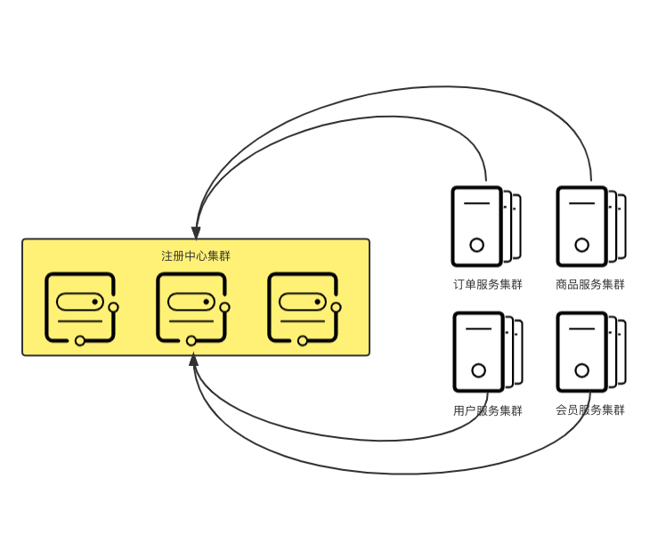

# 服务注册与发现

### 使用场景

微服务场景，分布式部署的情况下，建议使用服务注册与发现的对应实现框架。

如果只有少量服务，而且每个服务都是单体应用，实际上没有太大必要做服务注册与发现。


假设有一个商城系统，根据业务模型划分出了订单、用户等服务，但是每个服务只是单机部署，那么在服务间的调用完全不涉及到负载均衡，仅需保证服务可用，服务注册与发现在这种架构中的作用微乎其微。

当然这里只是例举了服务注册与发现中的一个功能。


### 概念

在服务注册与发现中有3个角色，2个动作。

* 注册中心
* 服务提供者
* 服务消费者
* 注册行为
* 发现行为


服务注册与发现在系统机构中其实属于C/S架构，注册中心属于服务端，而服务提供者和服务消费者都是客户端。

服务提供者和服务消费者只是业务上的概念，服务在提供接口的同时，也可以消费其他服务提供的接口。

这里区分出服务提供者与服务消费者的目的，只是便于理解。


### 注册中心

微服务注册到注册中心后，注册中心维护了该微服务的信息，如服务名、ip地址、端口等，具体需要参考各实现框架的文档，如Eureka、Nacos、ZooKeeper等。

### **服务注册**

简单的说，服务注册就是将微服务注册到注册中心这件事，一般有两种方式：

****

**自注册**

在客户端（服务提供者 / 服务消费者）中配置好注册中心地址，并在客户端代码中嵌入注册代码。

任何不通过第三方服务，将微服务注册到注册中心的行为都可以称为自注册。


在使用SpringCloud框架时使用`@EnableDiscoveryClient就是一个典型的自注册行为。`


****

**第三方注册**

所谓的第三方，其实就是一个单独的服务，通过这个第三方服务，将微服务注册到注册中心。

一般使用spring框架的项目是不需要第三方注册的，在spring cloud中，使用`@EnableDiscoveryClient`注解，并在配置文件中配上注册中心地址，spring框架会自动完成注册操作。

但是非JVM语言的服务想要注册到当前的注册中心时，则需要使用第三方注册了。


Spring Cloud框架提供了spring-cloud-netflix-sidecar依赖，该依赖可以提供第三方注册服务的开发。具体可以参考[Spring Cloud Sidecar文档](https://cloud.spring.io/spring-cloud-netflix/multi/multi\_\_polyglot\_support\_with\_sidecar.html)。


### 服务发现

当一个客户端想要访问服务时，客户端必须要找到服务的地址和其他一些信息。而注册中心中保存了各个微服务的注册信息，所以当微服务之间需要通信时，就需要从注册中心获取目标服务的信息，这就是服务发现。

服务发现有两种模式：

**客户端发现模式**

客户端定期从注册中心中获取所有服务信息，并缓存在本地，当需要请求目标服务时，客户端从本地缓存中获取目标服务信息。


这里的客户端是指服务消费者。



这里衍生出一个新问题，当目标服务是分布式部署时，客户端就需要完成负载均衡的任务。



相较于服务端模式，客户端模式会更加灵活，但是对代码有一定的侵入性。


****

**服务端发现模式**

服务端发现与客户端发现略有不同，这里的服务端并不是服务提供者，而是一个代理服务。

当客户端需要请求目标服务时，该请求会由代理服务接收，并根据缓存下来的服务注册信息，通过负载均衡策略，查找并请求对应目标服务。


代理服务通常由各注册中心的实现框架来提供。


**其他**

Sidecar模式

### 讨论

本篇主要是我对服务注册与发现中一些概念点的理解，并不涉及到具体的某个实践框架，接下来我会对[Nacos](https://nacos.io)这个框架做一些学习。

### 参考

[深入了解服务注册与发现](https://zhuanlan.zhihu.com/p/161277955)

[An Introduction to Microservices, Part 3: The Service Registry](https://auth0.com/blog/an-introduction-to-microservices-part-3-the-service-registry/)

[微服务注册中心和三种服务发现模式](https://blog.csdn.net/why444216978/article/details/115576285)
